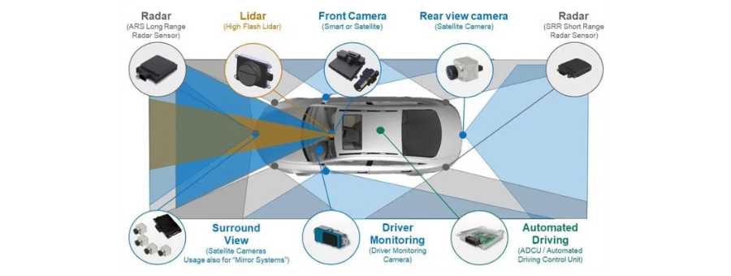
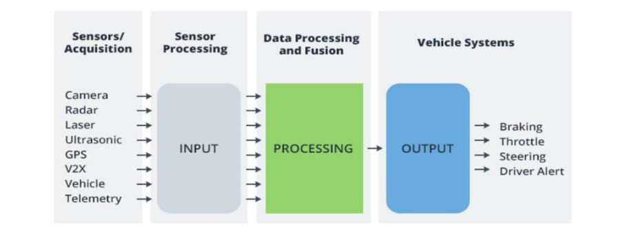
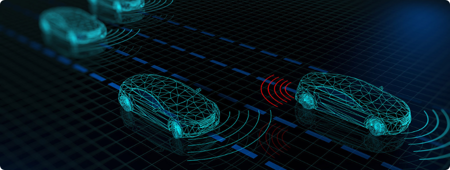

  

# Getting Started with ADAS

Advanced Driver Assistance Systems (ADAS) are technologies designed to improve driving safety, reduce human error, and support the path toward fully autonomous vehicles. This repo is a simple and structured place to learn the core concepts behind ADAS, the sensors used, how AI fits in, and how modern safety features work.

## What is ADAS

ADAS includes systems that monitor the surroundings of a vehicle, support the driver, and prevent accidents. These systems rely on multiple sensors, real‑time processing, and intelligent decision‑making.

## Course Overview

In this repo, you will find notes and explanations based on the **Udemy** course content, organized into clear sections:

### 1. Introduction

- What ADAS is
- Course outline and learning path

### 2. ADAS Basics

- General definition of ADAS with examples
- Common ADAS block diagram
- Role of ADAS in autonomous driving
- Examples of modern AD‑capable vehicles
- SAE Autonomous Driving Levels
- Key terms: ego vehicle, target vehicle, coordinate systems, field of view, blind spots

### 3. ADAS Sensors

Modern ADAS relies on a combination of sensors:

| Sensor Type              | Description                                                        |
| :----------------------- | :----------------------------------------------------------------- |
| **Radar**                | Measures distance and velocity of objects. Used for ACC, FCW, BSD. |
| **Camera (Mono/Stereo)** | Recognizes lanes, signs, objects, pedestrians.                     |
| **Lidar**                | High‑resolution 3D mapping for AD and advanced perception.         |
| **Ultrasonic**           | Short‑range detection for parking assist.                          |
| **GNSS / GPS**           | Provides global positioning.                                       |
| **IMU**                  | Measures acceleration and rotation for vehicle state estimation.   |

### 4. Role of AI in ADAS

- Why AI is important for next‑generation ADAS
- Deep learning in radar, camera, and lidar algorithms
- Sensor fusion examples
- Pointers to technical papers
- Overview of processors and hardware used for CNN‑based algorithms

### 5. ADAS Features – Part I

- Adaptive Cruise Control (ACC)
- Rear Cross Traffic Alert (RCTA)
- Vehicle Exit Alert
- Forward Cross Traffic Alert
- Forward Collision Warning (FCW)
- Vehicle Turn Assist
- Blind Spot Detection (BSD)
- Parking Assist
- Intelligent Headlight Control
- Occupant Protection
- Pedestrian Protection
- Evasive Steering Support

### 6. ADAS Features – Part II

- Traffic Sign Recognition (TSR)
- Speed Limit Assist
- Lane Departure Warning (LDW)
- 360° Surround View
- Driver Monitoring System
- Driver Drowsiness Detection
- Emergency Brake Assist
- Anti‑lock Braking System (ABS)
- Cross Wind Assist

### 7. Testing and Validation

- Overview of ADAS development workflow
- Why testing is critical
- Different types of testing:

  - Software‑in‑Loop (SiL)
  - Hardware‑in‑Loop (HiL)
  - Driver‑in‑Loop (DiL)
  - On‑field testing

- Use of robots for collision scenarios
- Visual animations and examples for understanding test tracks

### 8. Wrap‑Up and Downloads

Includes optional materials:

- Useful websites
- Books
- Technical papers on ADAS and autonomous driving
- (Optional) Python programming activities:

  - Computer vision
  - Machine learning
  - Deep learning
  - 7 guided exercises with problem statements and reference links

These activities are not part of the course videos but can help you practice ADAS‑related algorithms.

If you find this repo useful, feel free to share it. Contributions and suggestions are always welcome!
